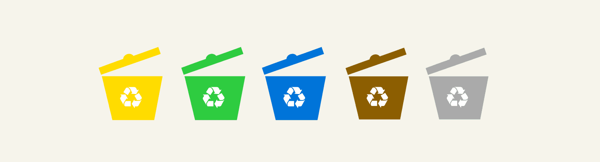

 

        <header class="app-header">
            
        </header>

        <main>
            <section class="hero">
                <h1 class="main-title">EcoSort.Barcelona</h1>
                
Welcome to the EcoSort.Barcelona support page.

                <a href="https://apps.apple.com/us/app/ecosort-barcelona/id6747254846" class="cta-button">
                    📱 Download on the App Store
                </a>
            </section>

            <section class="how-to-use">
                <h2>How to use EcoSort</h2>
                

                    
1. Select language

                    
2. Scan the packaging of your item

                    
3. Get clear sorting instructions and eco‑friendly tips

                

                

                    EcoSort isn’t just another recycling app. We want to make it effortless for everyone to dispose of waste correctly—no more confusion about bins, colors, or local rules. With EcoSort, you’ll spend less time worrying about “where does this go?” and more time feeling good about helping the planet. We’ll provide the information and tools—you do the sorting.
                

                 

                    If you have feedback, feature requests, or questions, reach out anytime at akor@ecosort.app
                

            </section>

            <section class="screenshots-section">
                <h2>App Screenshots</h2>
                

                    
                    
                    
                    
                

            </section>
        </main>

        <footer class="app-footer">
            
<strong>DISCLAIMER:</strong> EcoSort offers guidance based on publicly available recycling guidelines. Always double‑check local regulations, as rules can change. We do not provide legal or professional waste‑management advice—consider this a suggestion to help you get started.

            
Right now, we operate only in Barcelona, following Spain’s national recycling guidelines. But very soon, we’ll expand across all of Spain, and later to other countries in Europe.

            

                <a href="./privacy">Privacy Policy</a>
                |
                <a href="mailto:akor@ecosort.app">Contact us: akor@ecosort.app</a>
            

        </footer>

