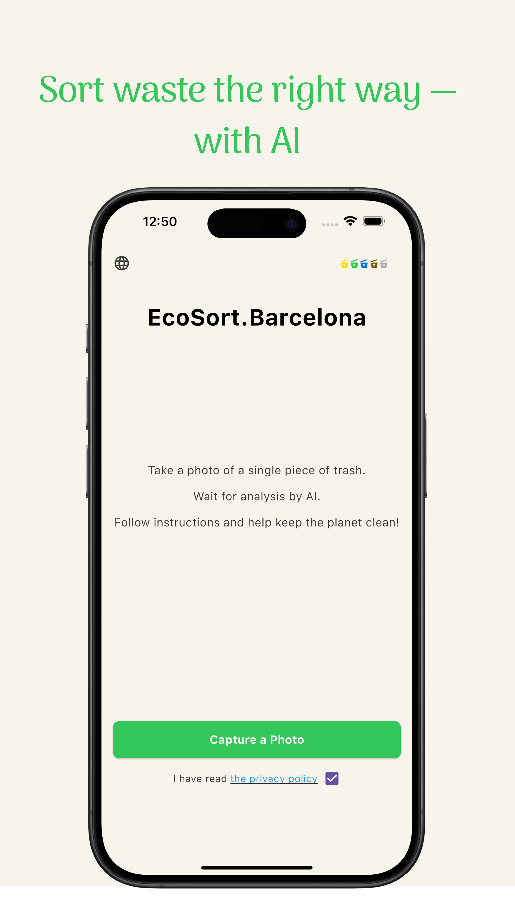

# EcoSort.Barcelona App Support

Welcome to the EcoSort.Barcelona support page.

📱 **Try our app now on the App Store**:  
👉 [Download EcoSort.Barcelona](https://apps.apple.com/us/app/ecosort-barcelona/id6747254846)

If you have any questions or issues with the app, please contact us via email:

📧 [ecosort.barcelona@gmail.com](mailto:ecosort.barcelona@gmail.com)

---

## How to use EcoSort

1. Select language  
2. Scan the packaging of your item  
3. Get clear sorting instructions and eco‑friendly tips

EcoSort isn’t just another recycling app. We want to make it effortless for everyone to dispose of waste correctly—no more confusion about bins, colors, or local rules. With EcoSort, you’ll spend less time worrying about “where does this go?” and more time feeling good about helping the planet. We’ll provide the information and tools—you do the sorting.

If you have feedback, feature requests, or questions, reach out anytime at ecosort.barcelona@gmail.com

---

**DISCLAIMER:** EcoSort offers guidance based on publicly available recycling guidelines. Always double‑check local regulations, as rules can change. We do not provide legal or professional waste‑management advice—consider this a suggestion to help you get started.

Right now, we operate only in Barcelona, following Spain’s national recycling guidelines.
But very soon, we’ll expand across all of Spain, and later to other countries in Europe.

---

## App Screenshots

  
  
  
  

---

## Privacy Policy

For our full privacy policy, please visit our [Privacy Policy page](./privacy).
